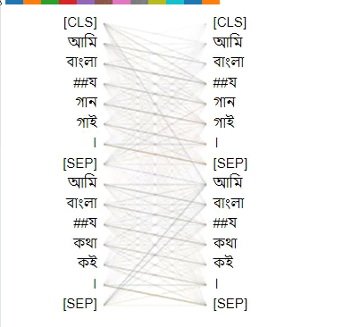

# Bangla BERT Base

A long way passed. Here is our **Bangla-Bert**! It is now available in [huggingface](https://huggingface.co/sagorsarker/bangla-bert-base) model hub. 

Bangla-Bert-Base is a pretrained language model of Bengali language using mask language modeling described in [BERT](https://arxiv.org/abs/1810.04805) and it's github [repository](https://github.com/google-research/bert)

**NB: If you use this model for any nlp task please share evaluation results with us. We will add it here.**

## Download Model
|  | TF Version | Pytorch Version | Vocab |
| ----- | ------ | ------- | --------|
| Bangla BERT Base | ----- | [Huggingface Hub](https://huggingface.co/sagorsarker/bangla-bert-base)| [Vocab](https://github.com/sagorbrur/bangla-bert/blob/master/vocab.txt)

## Pretrain Corpus Details
Corpus was downloaded from two main sources:

* Bengali commoncrawl copurs downloaded from [OSCAR](https://oscar-corpus.com/)
* [Bengali Wikipedia Dump Dataset](https://dumps.wikimedia.org/bnwiki/latest/)

After downloading these corpus, we preprocessed it as a Bert format. which is one sentence per line and an extra newline for new documents. 

```
sentence 1
sentence 2

sentence 1
sentence 2

```

## Building Vocab
We used [BNLP](https://github.com/sagorbrur/bnlp) package for training bengali sentencepiece model with vocab size 102025. We preprocess the output vocab file as Bert format.
Our final vocab file availabe at [https://github.com/sagorbrur/bangla-bert](https://github.com/sagorbrur/bangla-bert) and also at [huggingface](https://huggingface.co/sagorsarker/bangla-bert-base) model hub.

## Training Details
* Bangla-Bert was trained with code provided in Google BERT's github repository (https://github.com/google-research/bert)
* Currently released model follows bert-base-uncased model architecture (12-layer, 768-hidden, 12-heads, 110M parameters)
* Total Training Steps: 1 Million
* The model was trained on a single Google Cloud TPU 

## Evaluation Results

### LM Evaluation Results
After training 1 millions steps here is the evaluation resutls. 

```
global_step = 1000000
loss = 2.2406516
masked_lm_accuracy = 0.60641736
masked_lm_loss = 2.201459
next_sentence_accuracy = 0.98625
next_sentence_loss = 0.040997364
perplexity = numpy.exp(2.2406516) = 9.393331287442784
Loss for final step: 2.426227

```

### Downstream Task Evaluation Results
- Evaluation on Bengali Classification Benchmark Datasets

Huge Thanks to [Nick Doiron](https://twitter.com/mapmeld) for providing evalution results of classification task.
He used [Bengali Classification Benchmark](https://github.com/rezacsedu/Classification_Benchmarks_Benglai_NLP) datasets for classification task.
Comparing to Nick's [Bengali electra](https://huggingface.co/monsoon-nlp/bangla-electra) and multi-lingual BERT, Bangla BERT Base achieves state of the art result.
Here is the [evaluation script](https://github.com/sagorbrur/bangla-bert/blob/master/notebook/bangla-bert-evaluation-classification-task.ipynb). Check comparison between Bangla-BERT with recent other Bengali BERT [here](https://gist.github.com/mapmeld/cfdfa5604a0b03730b0dbee8c5789f42)


| Model | Sentiment Analysis | Hate Speech Task | News Topic Task | Average |
| ----- | -------------------| ---------------- | --------------- | ------- |
| mBERT | 68.15 | 52.32 | 72.27 | 64.25 |
| Bengali Electra | 69.19 | 44.84 | 82.33 | 65.45 |
| Bangla BERT Base | **70.37** | **71.83** | **89.19** | **77.13** |
  
- Evaluation on [Wikiann](https://huggingface.co/datasets/wikiann) Datasets

We evaluated `Bangla-BERT-Base` with [Wikiann](https://huggingface.co/datasets/wikiann) Bengali NER datasets along with another benchmark three models(mBERT, XLM-R, Indic-BERT). </br>
`Bangla-BERT-Base` got a third-place where `mBERT` got first and `XML-R` got second place after training these models 5 epochs.

| Base Pre-trained Model | F1 Score | Accuracy |
| ----- | -------------------| ---------------- |
| [mBERT-uncased](https://huggingface.co/bert-base-multilingual-uncased) | 97.11 | 97.68 |
| [XLM-R](https://huggingface.co/xlm-roberta-base) | 96.22 | 97.03 |
| [Indic-BERT](https://huggingface.co/ai4bharat/indic-bert)| 92.66 | 94.74 |
| Bangla-BERT-Base | 95.57 | 97.49 |

All four model trained with [transformers-token-classification](https://colab.research.google.com/github/huggingface/notebooks/blob/master/examples/token_classification.ipynb) notebook.
You can find all models evaluation results [here](https://github.com/sagorbrur/bangla-bert/tree/master/evaluations/wikiann)


Also you can check these below paper list. They used this model on their datasets.
* [arXiv:2012.14353](https://arxiv.org/abs/2012.14353)
* [arxiv:2104.08613](https://arxiv.org/abs/2104.08613)

**NB: If you use this model for any nlp task please share evaluation results with us. We will add it here.** 

Check [Bangla BERT Visualize](notebook)



## How to Use

**Bangla BERT Tokenizer**
```py
from transformers import AutoTokenizer, AutoModel

bnbert_tokenizer = AutoTokenizer.from_pretrained("sagorsarker/bangla-bert-base")
text = "আমি বাংলায় গান গাই।"
bnbert_tokenizer.tokenize(text)
# ['আমি', 'বাংলা', '##য', 'গান', 'গাই', '।']
```


**MASK Generation**

You can use this model directly with a pipeline for masked language modeling:

```py
from transformers import BertForMaskedLM, BertTokenizer, pipeline

model = BertForMaskedLM.from_pretrained("sagorsarker/bangla-bert-base")
tokenizer = BertTokenizer.from_pretrained("sagorsarker/bangla-bert-base")
nlp = pipeline('fill-mask', model=model, tokenizer=tokenizer)
for pred in nlp(f"আমি বাংলায় {nlp.tokenizer.mask_token} গাই।"):
  print(pred)

# {'sequence': '[CLS] আমি বাংলায গান গাই । [SEP]', 'score': 0.13404667377471924, 'token': 2552, 'token_str': 'গান'}

```

## Author
[Sagor Sarker](https://github.com/sagorbrur)

## Acknowledgements

* Thanks to Google [TensorFlow Research Cloud (TFRC)](https://www.tensorflow.org/tfrc) for providing the free TPU credits - thank you!
* Thank to all the people around, who always helping us to build something for Bengali.

## Reference
* https://github.com/google-research/bert

## Citation
If you find this model helpful, please cite this.

```
@misc{Sagor_2020,
  title   = {BanglaBERT: Bengali Mask Language Model for Bengali Language Understading},
  author  = {Sagor Sarker},
  year    = {2020},
  url    = {https://github.com/sagorbrur/bangla-bert}
}

```


